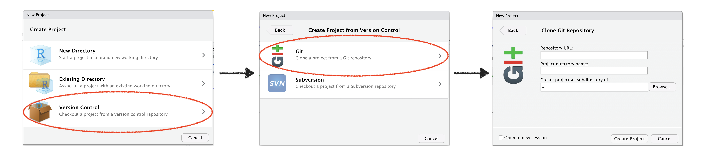

```{r setup}
# The first line sets an option for the final document that can be produced from
# the .Rmd file. Don't worry about it.
knitr::opts_chunk$set(echo = TRUE)

# The next bit (lines 50-69) is quite powerful and useful. 
# First you define which packages you need for your analysis and assign it to 
# the p_needed object. 
p_needed <-
  c("viridis", "knitr")

# Now you check which packages are already installed on your computer.
# The function installed.packages() returns a vector with all the installed 
# packages.
packages <- rownames(installed.packages())
# Then you check which of the packages you need are not installed on your 
# computer yet. Essentially you compare the vector p_needed with the vector
# packages. The result of this comparison is assigned to p_to_install.
p_to_install <- p_needed[!(p_needed %in% packages)]
# If at least one element is in p_to_install you then install those missing
# packages.
if (length(p_to_install) > 0) {
  install.packages(p_to_install)
}
# Now that all packages are installed on the computer, you can load them for
# this project. Additionally the expression returns whether the packages were
# successfully loaded.
sapply(p_needed, require, character.only = TRUE)
```

---

## Program for today

1. I will briefly talk about what you can expect from the lab sessions and what I expect.
  + GitHub.
  + Organization of the lab sessions.
  + Homework assignments.
2. We look under the hood of R Notebooks - the main tool we will work with in the lab sessions.
3. We refresh some R Skills and have a look at Matrix Algebra in R.
 
---

## The Lab

The general **content** of a lab session will be something like:

+ Implement/Translate the concepts and estimators from the lecture in R.
+ Explore properties of new estimators using simulations.
+ If time perits, we may discuss extensions of estimators introduced in the lecture.
+ Adress open questions about the lecture. The lab will not be a second lecture, however, I am more than happy to answer your questions about the lecture--if I can. 
+ Prepare for homework assignments and discuss solutions.

As a result, **you can expect** the lab sessions to prepare you to ...

+ ... translate theoretical/mathematical concepts into statistical programs.
+ ... write your own estimators.
+ ... explore properties of your own estimators using simulations.
+ ... become an advanced R programmer.
+ ... understand the technical side of statistical programs.

### Structure of the lab sessions

I aim split each lab session into two parts:

  - **Phase 1** (~60 minutes): In this part I will give you input. This includes all the points mentioned above. Whether you run the code simultaneously on your computer or not is completely up to you -- but its absolutely fine to simply listen and watch without doing any coding. You are welcome to interrupt us at any time if you have questions or feel like the pace is too high.
  
  - **Phase 2** (~30 minutes): Now its your turn! In this phase you will work on exercises that are similar to the stuff I discussed in phase 1. This is all about you trying things out, doing mistakes, trying again, and succeed. Within this phase I will distribute you into break out rooms. Think of it like virtual neighbours in the lab you can talk to. You can talk to your neighbours if you have any problems or, if things are easy for you, to explain the stuff you learned to others. I will be around as well and try to solve problems and difficulties that come up. Please do not hesitate at all to make use of that.


### GitHub workflow

As in QM, we will work with GitHub. I assume that by now you downloaded and installed R and Rstudio and have your personal GitHub account.

**All of you who did not take QM in 2020 should have received an e-mail with instructions on how to set-up your GitHub account. If this is not the case: Send me an e-mail after this class.**

The course has its own page on GitHub, you can find it here: [https://github.com/uni-mannheim-aqm-2022](https://github.com/uni-mannheim-aqm-2021). This is the place where you can find all relevant materials for the lab sessions. It is also the place where you download and hand-in your homework assignments. 

For those of you who are new to GitHub here is how you will get your materials:

#### Get the URL of the repo for the current week

Go to [https://github.com/uni-mannheim-aqm-2021](https://github.com/uni-mannheim-aqm-2021) and click on the repository for the current week (this week, this is called `week01_welcome_back`). Now, click on the green **Clone or download** button and select **Use HTTPS** (this might already be selected by default, and if it is, you’ll see the text Clone with HTTPS as in the image below). Click on the clipboard icon to copy the repo URL.


#### Import the repository in RStudio

  1. Open RStudio.
  2. Click on `File` on the top bar and select `New Project...`.



  3. Select `Version Control`. 
  4. In the next window, select `Git`.
  5. In the final window, paste the repo URL you grabbed from GitHub in the `Repository URL` window. Click on `Browse` to select the folder on your computer where you want to store the project.
  6. Click on `Create Project`.


Most of your fellow students are familiar with the workflow by now, so if there are any problems, please try to help each other. If you still have problems, I am happy to help.

## Homework Assignments

There will be **six homework assignments**. All assignments will contain both theoretical questions and practical tasks that will require you to write `R` code.

The homeworks will be challenging. Some parts will potentially be very challenging. While there will be some parts that ask you to directly apply material from the lecture and the lab, there will be other exercises that will introduce new but related material. Since this is an elective, advanced course, I expect you to approach challenges with ambition and an open mind. I strongly advice you to work in groups (of three). Plan at least one day--a.k.a. 8 hours--to work through all exercises. 

For every homework assignment you can get a **maximum of 20 points**. There will always be **optional exercises** that are worth **3 extra points**.

Although the homeworks should push you towards your limits, they are not intended to frustrate you. If you cannot figure out a question (which I suspect will happen at some point), you can do the following (preferably in this order):

1. Talk to your group members and classmates. Everybody has strengths and weaknesses, good and bad days. This class is a collective learning enterprise and team work is highly encouraged.
2. Post your question on ILIAS. I will open a question forum thread for each homework assignment where you can ask questions and share materials with your fellow students. I encourage you to use it.
3. Come to my office hours. I have 90 minutes on Mondays (4 pm to 5.30 pm on Zoom) reserved for AQM questions. Please use the ILIAS scheduling tool by Monday morning (10 a.m.) if you want to come by. If you already have specific questions you want to ask, include them already so that I can plan and prepare for your questions ahead of time. If Monday does not work for you at all, send me an email and we can make an appointment.
4. Talk to Thomas Gschwend. I would recommend that you use this option as a last resort. For example, if I am unable to answer your questions. Mostly, you should use Thomas Gschwend's office hours to discuss your final paper ideas.

### Homework Groups

Other than last semester, you are free to form your own homework groups and work together for the entire semester. Please start organizing your homework group after today's session. If you formed a group, send me a mail with your names, preferably **by Monday morning**. If you do not find a group, send me a mail by Monday as well and I will try to figure it out for you. You can also shortly summarise your research interests, so I can try to find a well fitting group for you.

Homweork assignments will be distributed via GitHub after the lecture on Wednesdays. Assignemts are due by the following Tuesday, 23:59. 

#### Your homework submissions

You will hand in your homework assignments on GitHub. Your repository should include at least two files:

  + an .Rmd file with your solutions.
  + a .pdf write-up. Preferably, this is just the knitted version of your .Rmd file. Make sure to use chunk-option to format the write-up nicely.


## R Notebooks

### Software first. 

We need the following software for the lab:

+ [R](http://www.r-project.org/) (I run R version 4.0.4)
+ [R-Studio](http://rstudio.org/) (I run RStudio version 1.2.5019)
+ [git](https://git-scm.com/downloads)
+ If you want to produce .pdf files from RStudio, you need a Latex compiler. If you do not have that by now, running `install.packages("rmarkdown")` should do it for you.


### Deep dive R Notebooks.

Everyone who took Multivariate Analyses last semester has seen a .Rmd document/R Notebook like this one before. So far all you had to know about these documents was that they worked... Today we will dive a bit deeper.

Markdown is a very simple language to write documents and transform them to all sorts of formats. Just to name a few: Word, pdf, html, open office, beamer presentations, html5 presentations. 

The best thing about it: It allows us to integrate `R`-code in the markdown language. This is very straightforward, just like in this file we have to indicate what is code and `knitr` will first calculate all the code chunks and put them in the final markdown document. RStudio directly translates this document to html. When you save the notebook, an HTML file containing the code and output will be saved alongside it (click the _Preview_ button or press _Cmd+Shift+K_ to preview the HTML file).

We start with a little detour: In markdown it is really easy to format text. This is _italic_, this is **bold**, this is _**italic and bold**_.

1. First ordered list item
2. Another item
    + Unordered sub-list. (two tabs and +)
1. Actual numbers don't matter, just that it's a number
    1. Ordered sub-list. (two tabs and a number)
4. And another item.

The same list without numbers: 

* First ordered list item
* Another item
    + Unordered sub-list. (two tabs and +)
* Actual numbers don't matter, just that it's a number
    1. Ordered sub-list. (two tabs and a number)
* And another item.

R Markdown integrates really well with R Code. You can include a new code chunk by pressing _Cmd+Alt+I_. In a code chunk you can write and evaluate all your favorite R Code and include the results directly in your document. For example a plot. 

```{r A chunk with a plot}
x <- rnorm(1000)
y <- rnorm(1000)

par(fig = c(0, 0.9, 0, 0.8), bg = "#ffffff")
plot(
  x,
  y,
  bty = "n",
  pch = 19,
  las = 1,
  col = adjustcolor("black", alpha = 0.5)
)
par(fig = c(0, 0.9, 0.45, 1), new = TRUE)
boxplot(x,
        horizontal = TRUE,
        axes = FALSE,
        col = NA)
par(fig = c(0.6601, 1, 0, 0.8), new = TRUE)
boxplot(y, axes = FALSE, col = NA)
mtext(
  "A scatterplot of x and y",
  side = 3,
  outer = TRUE,
  line = -3,
  font = 2
)
```

What if you preferred a table over a plot? 

```{r Chunk with a table}
df <- data.frame(y = y, x = x)
summary(df)
```

You can even call R objects inline. Like: The second value of x is `r round(x[2],2)`. This is really helpful for writing up results that change from time to time (like simulations).

In a paper you usually don't want to include the code that produced your plots and numbers (however for your homework assignments you always have to include it).

No problem, you can set a lot of so called chunk options, like `echo`. If you set `echo` to `FALSE`, then only the output of the code chunk will be included in your final document. But not the code itself.

```{r Display a table but not the code, echo = FALSE}
df <- data.frame(y = y, x = x)

summary(df)
```

Or maybe sometimes you want to include R code but not the output (e.g. for data preparation)? Just set `results = 'hide'`. (Note that you could also use the option `eval = FALSE` to achieve something similar. At least at first sight. Can anyone guess what the difference might be?)

```{r Chunk with table but no table, results = 'hide'}
df <- data.frame(y = y, x = x)

summary(df)
```


## R Refresher and Matrix Algebra

So much for the setup. Now it's time for some R.
 
I assume that you are familiar with basic R commands. That means, you know what the term "object-orientation" means, know how to make assignments, you are familiar with basic data structures such as scalar, vector, matrix, array, list, data frame. You know how to select elements from these objects and how to load and manipulate data.

In the last course you also gained some experience in writing your own functions. As a refresher, this section gives you a short overview.

### Writing functions in R.

A function has a name, typically at least one argument, and a body of code that tells the function what to do with the input. In the end, the function usually specifies what to return.

```{r An example of a R function, eval = FALSE}
my_function <- function(argument1, argument2) {
  statements
  return(something)
}
```

(Of course that R function won't work. Thats why I set `eval = FALSE` so that R doesn't even try to evaluate the function. The (pseudo-)code will be included in the final document nevertheless.)

An argument can be any type of object (a scalar, matrix, array, etc). Let's write a simple function that works and returns the square of an (numeric) object.


```{r Square function}
square_it <- function(x) {
  square <- x * x
  return(square)
}
```

Let's see if it works.

```{r Square everything}
square_it(15)

a <- c(1, 5, 9)

square_it(a)

M <- matrix(c(1:9),
            nrow = 3,
            ncol = 3,
            byrow = T)
M

square_it(M)
```

Of course, it seems silly to write a function when I can use an implemented operator. Typically, the functions you will write are more complicated and have more arguments. It is hard to keep track when functions become long and complicated. For that reason, it is helpful to know that you can call functions within another function.

```{r A complicated function}
complicated_function <- function(scalar, vector, matrix) {
  # square the scalar
  squared_scalar <- square_it(scalar)
  
  # multiply matrix and vector
  mult <- matrix %*% vector
  
  # multiply scalar and result above, then square it again
  res <- square_it(squared_scalar * mult)
  
  # return the result
  return(res)
}
```

Let's evaluate the function.

```{r Evaluating a complicated function}
complicated_function(5, a, M)
```

When functions get long and complicated it can be helpful to write multiple, simple functions and then call them inside of a master function. Also, it is really important and helpful to comment every operation that your function fulfills for future references. (It may be obvious what we are doing now. But someone else or even future me might have a hard time figuring out every line of code.)

### Matrix Algebra in R.

In AQM we will rely on matrix algebra a lot. We will start with OLS in matrix next week. This section introduces you to the basic syntax and error messages you will frequently use and see.

Let's start with often used object types.


```{r Scalar - Vector - Matrix}
# a scalar
scalar <- 2
scalar

# a vector
vector <- c(1:3)
vector

# a matrix
M <- matrix(c(1:9),
            nrow = 3,
            ncol = 3,
            byrow = T)
M

# a diagonal matrix e.g. identity matrix
M_diag <- diag(1, nrow = 3, ncol = 3)
M_diag
```

```{r Matrix Math, eval = F}
# Scalar-Vector/Matrix multiplication

scalar * vector
scalar * M

# Vector-Vector/Matrix multiplication

vector * vector
vector %*% vector # What's the difference?

vector * M

vector
M

vector %*% M

# Matrix-Matrix multiplication

# elementwise multiplication
M * M

# dot product
M %*% M

M2 <- matrix(c(1:6),
             nrow = 3,
             ncol = 2,
             byrow = T)

M * M2
M2 * M

M %*% M2
M2 %*% M
```

Usually, when multiplying matrices, we are going to use the `%*%` command.
Now all we need is the commands for two more common matrix operations.
**The transpose** i.e. $M'$ and **the inverse** i.e. $M^{-1}$.

Who wants to transpose the following matrices for me? 

$\begin{pmatrix} 1 & 2 \\ 2 & 3 \end{pmatrix}$

$\begin{pmatrix} 1 & 1 & 1 \\ 2 & 3 & 4\\ 4 & 5 & 6 \end{pmatrix}$

Now the inverse of $\begin{pmatrix} 1 & 2 \\ 2 & 3 \end{pmatrix}$?

Luckily, the transpose and inverse are already implemented in R for us. So we can spend some more time on more interesting things.

```{r Matrix Operations, eval = FALSE}
# The transpose
t(M)
t(t(M)) == M

# The inverse
solve(M2)
solve(M) # What went wrong?

M3 <- matrix(c(1, 2, 2, 3),
             nrow = 2,
             ncol = 2,
             byrow = TRUE)
M3

solve(M3)
t(M3)

M3 %*% solve(M3)
```


### Exercise I

A lab session without an exercise would be boring. So here is your first AQM `R` exercise in 2021. 

1. I want you to create a $n \times 1$ (column) vector $y$, and a $n \times k$ matrix $X$ (you can choose $n$ and $k$ freely...), both objects should contain random numbers. Remember that it is always $rows \times columns$ (Roller Coaster, Roman Catholic ...).
2. Then, write a function that returns the value $(X'X)^{-1}X'y$ (you have seen that on the Syllabus... and in the next session you will learn how to derive this formula).
3. Before you run the function: What will be the dimensions of the output? 


```{r Exercise I, eval = FALSE}
X <- matrix(rnorm(12), 
            nrow = 4, 
            ncol = 3)

y <- rnorm(4)


beta <- function(X, y) {
  return(solve(t(X) %*% X) %*% t(X) %*% y)
  
}


beta(X, y)
```


